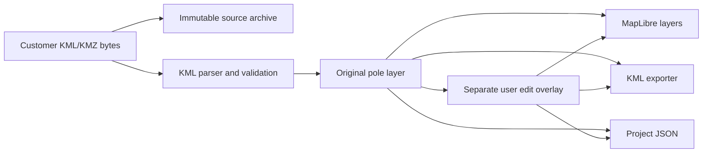

# Architecture

## Boundary

The application is local-first and split into two processes:

1. A FastAPI service owns file ingestion, KML/KMZ parsing, validation, project persistence, and export.
2. A React/TypeScript client owns the map-centred interaction, layer state, selection, editing, undo/redo, and file downloads.

The browser never mutates a source file. A project records source poles and user edits as separate collections. Calculated and recommended layers are separate future collections.

## Application components

- `backend/app/models.py`: authoritative Pydantic input/output models.
- `backend/app/services/kml.py`: safe KML/KMZ import, validation, deterministic pole IDs, and updated KML export.
- `backend/app/services/store.py`: local project storage with atomic JSON writes and immutable source uploads.
- `backend/app/main.py`: HTTP API and generated OpenAPI schema.
- `backend/app/catalog_models.py`: authoritative Phase 2 operational catalog contracts.
- `backend/app/services/catalogs.py`: atomic operational catalog persistence, immutable full-record history, and immutable template-revision workflow.
- `backend/app/services/ies.py`: validated LM-63 upload parser; no illuminance engine.
- `backend/app/services/lighting_calculation.py`: deterministic projected point grid, Type C interpolation, direct horizontal illuminance, statistics, exclusions, and complete Phase 4 provenance.
- `backend/app/services/wifi_coverage.py`: deterministic projected-plane conceptual circles, indexed aggregate overlap, area clipping, limits, fingerprinting, and stale-result invalidation.
- `backend/app/services/cap_planning.py`: strict preflight, projected-distance graph construction, deterministic bounded recommendation/validation, manual constraints, redundancy diagnostics, safety limits, provenance, and CAP fingerprints.
- `backend/app/services/configuration.py`: exact revision resolution, lifecycle/capability validation, corrective pin migration, and explicit-field bulk configuration.
- `backend/app/services/camera_geometry.py`: deterministic projected-CRS frustum/ground intersection, overlap unions, priority-area intersections, and complete calculation provenance.
- `frontend/app/components/EngineeringWorkspace.tsx`: toolbar, layer panel, MapLibre map, inspector, and status bar.
- `frontend/app/components/CatalogManager.tsx`: fixture, IES, camera, and lens management.
- `frontend/app/components/PoleInspector.tsx`: model-dependent per-pole lighting, Wi-Fi, and SMART camera configuration.
- `frontend/app/components/EngineeringMap.tsx`: independent camera, lighting, Wi-Fi, CAP candidate/selected/tree, warning, and fixture layers plus the fixture-level azimuth handle; no camera-level direction controls.
- Enabled-camera calculation warnings appear in the global validation list and a pole-level map indicator controlled by the Warnings layer; disabled slots do not contribute errors.
- `frontend/app/lib/api.ts`: typed backend transport and local file downloads.
- `schemas/project.schema.json`: repository-owned machine-readable project schema.
- `schemas/openapi.json`: generated HTTP contract for session-to-session API continuity.

## Data flow

## Trust boundaries

- XML is parsed with `defusedxml`; external entities are not resolved.
- KMZ archives are inspected for path traversal, entry count, uncompressed size, and compression-ratio limits.
- Filenames are reduced to safe basenames before storage.
- All coordinate changes must carry the explicit `location_edit_authorized` flag and remain reversible to source values.
- Proposed-layout APIs do not exist in Phase 1.

## Local operation

The API defaults to `http://127.0.0.1:8000`; the web client defaults to `http://127.0.0.1:3000`. The frontend reads `NEXT_PUBLIC_API_URL` when a different API origin is required.

Project persistence is deliberately filesystem-based in Phase 1: `backend/data/projects/<project-id>/project.json` and an immutable `sources/` copy. The directory is runtime state and is not committed. The portable JSON export embeds the uploaded source bytes as Base64 so a project can reopen without a separate source file.

The MapLibre base layer uses OpenStreetMap raster tiles. Pole data and editing remain local, but displaying the background map requires network access unless a future session adds an approved offline tile source.

The frontend retains the bundled Sites/Vinext worker scaffold for local development and production compilation. D1/database helpers are not used by Phase 1.

## Phase 3 calculation flow

SMART user configuration and immutable pinned catalog/template revisions feed a pure geometry service. The service transforms the authoritative source pole coordinate into the project-selected projected CRS, intersects four pinhole-frustum boundary rays with local Z=0, and stores projected/WGS84 rings plus exact lens FOV and mounting-contract provenance in `camera_geometry`. Overlap and priority-area metrics use Shapely in projected metres. Priority rename and redraw are separate commands, and replacement validates before mutating the saved ring. Recalculation never writes source poles or user assignments.

## Future phase seams

Pixel density has a revision-aware `not-calculated` result seam. Phase 4 lighting is persisted in `calculation_areas` and `lighting_calculations`, fully separate from camera `priority_areas`. Phase 5 Wi-Fi is persisted in separate `wifi_analysis_areas` and `wifi_coverage` collections. Phase 6 CAP inputs, calculations, and recommendations are separate strict collections. Phase 7 reporting and proposed/automatic pole workflows remain unavailable.

## Phase 4 calculation flow

An explicit calculate action transforms a validated lighting polygon and every eligible unchanged source-pole origin into the project CRS. A deterministic CRS-zero lattice is clipped inside or within `1e-7 m` of the boundary. Each point is transformed into the luminaire-local Type C frame with local C-plane angle `(world azimuth - fixture azimuth) mod 360`. Bilinear angle interpolation supplies candela; direct horizontal illuminance is `I(gamma,C) * h / r^3`. Eligible fixture contributions are summed with `math.fsum`, then the area maintenance factor is applied. Results and provenance persist separately from source data and pole configuration.

Each persisted lighting result carries a SHA-256 fingerprint of its projected CRS, calculation-area inputs, defaults, source origins, and lighting-significant pole configuration. Frontend edits and backend save/open/bulk/calculate paths clear results whose fingerprint no longer matches, so obsolete values cannot be displayed or reopened as current.

## Phase 6 planning flow

Explicit approval-bearing CAP profile data, fixture-type node policies, candidate sites, and manual constraints feed a pure planning service. It validates a projected metre CRS, constructs a bounded spatial-index distance graph, and performs deterministic Validate or recommend-from-approved-pool operations without creating or moving coordinates. Gateway roots remain distinct from co-located fixture nodes. Results store canonical topology, operation counts, exact constraint/catalog provenance, fingerprints, warnings, and the permanent graph-only disclaimer. Significant edits invalidate both CAP result collections across backend and frontend save/open/undo/redo paths.
