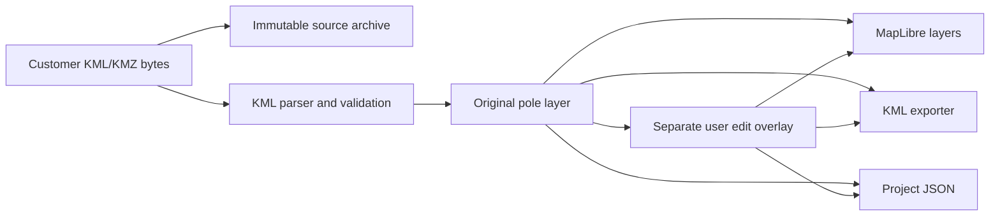

# Architecture

## Boundary

The application is local-first and split into two processes:

1. A FastAPI service owns file ingestion, KML/KMZ parsing, validation, project persistence, and export.
2. A React/TypeScript client owns the map-centred interaction, layer state, selection, editing, undo/redo, and file downloads.

The browser never mutates a source file. A project records source poles and user edits as separate collections. Calculated and recommended layers are separate future collections.

## Phase 1 components

- `backend/app/models.py`: authoritative Pydantic input/output models.
- `backend/app/services/kml.py`: safe KML/KMZ import, validation, deterministic pole IDs, and updated KML export.
- `backend/app/services/store.py`: local project storage with atomic JSON writes and immutable source uploads.
- `backend/app/main.py`: HTTP API and generated OpenAPI schema.
- `frontend/app/components/EngineeringWorkspace.tsx`: toolbar, layer panel, MapLibre map, inspector, and status bar.
- `frontend/app/lib/api.ts`: typed backend transport and local file downloads.
- `schemas/project.schema.json`: repository-owned machine-readable project schema.
- `schemas/openapi.json`: generated HTTP contract for session-to-session API continuity.

## Data flow

## Trust boundaries

- XML is parsed with `defusedxml`; external entities are not resolved.
- KMZ archives are inspected for path traversal, entry count, uncompressed size, and compression-ratio limits.
- Filenames are reduced to safe basenames before storage.
- All coordinate changes must carry the explicit `location_edit_authorized` flag and remain reversible to source values.
- Proposed-layout APIs do not exist in Phase 1.

## Local operation

The API defaults to `http://127.0.0.1:8000`; the web client defaults to `http://127.0.0.1:3000`. The frontend reads `NEXT_PUBLIC_API_URL` when a different API origin is required.

Project persistence is deliberately filesystem-based in Phase 1: `backend/data/projects/<project-id>/project.json` and an immutable `sources/` copy. The directory is runtime state and is not committed. The portable JSON export embeds the uploaded source bytes as Base64 so a project can reopen without a separate source file.

The MapLibre base layer uses OpenStreetMap raster tiles. Pole data and editing remain local, but displaying the background map requires network access unless a future session adds an approved offline tile source.

The frontend retains the bundled Sites/Vinext worker scaffold for local development and production compilation. D1/database helpers are not used by Phase 1.

## Future phase seams

Catalogs, camera geometry, conceptual Wi-Fi, lighting, and CAP are represented in the schema and UI only where needed to prevent accidental claims. Their engines are not implemented or enabled in Phase 1.
